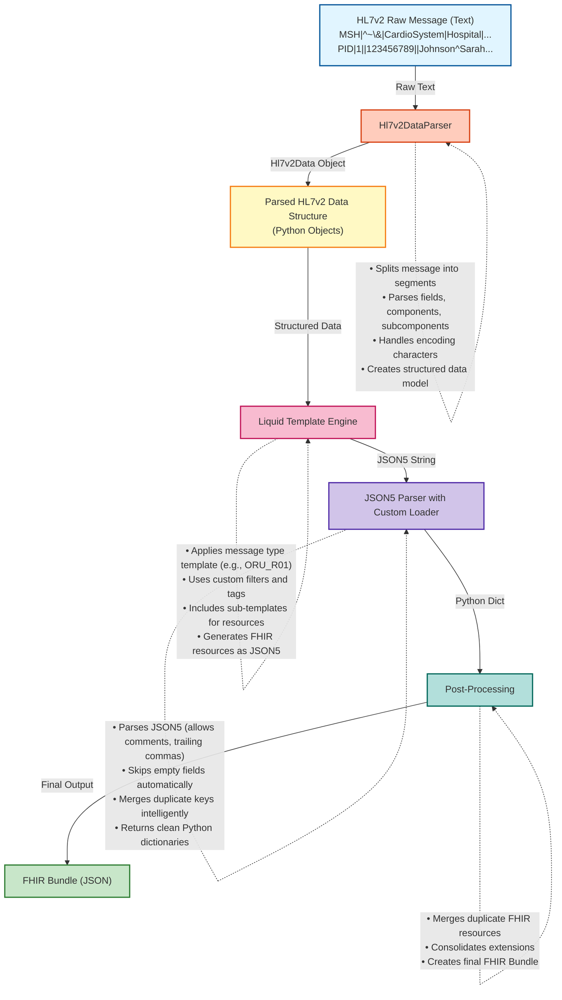

# Python FHIR Converter - High-Level Architecture

## Overview

The Python FHIR Converter is a data transformation library that converts healthcare data formats (HL7v2, CDA, STU3) to FHIR R4 format. This document focuses on the HL7v2 to FHIR conversion pipeline, explaining the core principles and data flow through the system.

## Table of Contents

1. [Architecture Overview](#architecture-overview)
2. [Core Components](#core-components)
3. [HL7v2 to FHIR Conversion Pipeline](#hl7v2-to-fhir-conversion-pipeline)
4. [Data Model](#data-model)
5. [Liquid Templating System](#liquid-templating-system)
6. [JSON5 Integration](#json5-integration)
7. [Extension System](#extension-system)
8. [Example Workflow](#example-workflow)

---

## Architecture Overview



---

## Core Components

### 1. **Hl7v2DataParser** (`parsers.py`)
The parser is responsible for converting raw HL7v2 messages into a structured Python object model.

**Key Responsibilities:**
- Parse encoding characters from MSH segment (field separators, component separators, etc.)
- Split message into segments (by line breaks)
- Parse each segment into fields (split by field separator `|`)
- Parse fields into repeating fields (split by repetition separator `~`)
- Parse components within fields (split by component separator `^`)
- Parse subcomponents (split by subcomponent separator `&`)
- Handle escape sequences
- Normalize text for use in templates

**Output Structure:**
```python
Hl7v2Data
├── message: str                    # Original message
├── encoding_characters: Hl7v2EncodingCharacters
├── meta: List[str]                 # Segment IDs ["MSH", "PID", "OBR", ...]
└── data: List[Hl7v2Segment]       # Parsed segments
    └── Hl7v2Segment
        ├── normalized_text: str
        └── fields: List[Hl7v2Field]
            └── Hl7v2Field
                ├── value: str
                ├── components: List[Hl7v2Component]
                └── repeats: List[Hl7v2Field]
                    └── Hl7v2Component
                        ├── value: str
                        └── subcomponents: List[str]
```

### 2. **Hl7v2Renderer** (`renderers.py`)
The renderer orchestrates the conversion from HL7v2 to FHIR.

**Key Methods:**
- `_parse_hl7v2()`: Invokes the parser to convert raw text to structured data
- `_render()`: Applies Liquid templates to generate FHIR resources
- `post_process_fhir()`: Cleans up and merges duplicate resources

**Rendering Flow:**
```python
def _render(self, template_name: str, data_in: DataInput, encoding: str = "utf-8"):
    # 1. Get the appropriate template (e.g., "ORU_R01")
    template = self.env.get_template(template_name, globals=self.template_globals)
    
    # 2. Parse HL7v2 message into structured data
    hl7v2_data = self._parse_hl7v2(data_in, encoding)
    
    # 3. Render template with data (returns JSON5 string)
    json5_output = template.render({"hl7v2Data": hl7v2_data})
    
    # 4. Parse JSON5 and post-process (merge duplicates, consolidate extensions)
    return post_process_fhir(json5_output)
```

### 3. **Liquid Template Engine** (`renderers.py`, `filters.py`, `tags.py`)
Based on the `python-liquid` library, extended with custom filters and tags for FHIR conversion.

**Custom Filters** (selection):
- `get_first_segments`: Extract the first occurrence of specified segments
- `get_segment_lists`: Get all occurrences of specified segments
- `get_related_segment_list`: Find child segments related to a parent segment
- `format_as_date_time`: Convert HL7v2 timestamps to FHIR format
- `generate_uuid`: Generate unique identifiers
- `to_json_string`: Serialize objects to JSON

**Custom Tags:**
- ``: Generate unique IDs for FHIR resources
- ``: Include sub-templates for specific FHIR resources

### 4. **JSON5 Parser with Custom Loader** (`parsers.py`)
The custom `Json5SkipEmptyLoader` extends the standard JSON5 parser to intelligently handle empty values.

**Key Features:**
```python
class Json5SkipEmptyLoader(DefaultLoader):
    def json_object_to_python(self, node):
        d = {}
        for key_value_pair in node.key_value_pairs:
            key = self.load(key_value_pair.key)
            value = self.load(key_value_pair.value)
            
            # Skip empty values
            if value is None or value == "" or value == {} or value == []:
                continue
            
            # Handle duplicate keys intelligently
            if key in d:
                if isinstance(d[key], list):
                    d[key].append(value)
                elif isinstance(d[key], dict):
                    merge_dict(d[key], value)
                else:
                    if value:
                        d[key] = value
            else:
                d[key] = value
        return d
```

**Why JSON5?**
- Allows comments in templates for documentation
- Supports trailing commas (easier template maintenance)
- More lenient syntax for generated JSON
- Automatically cleaned by the custom loader

---

## HL7v2 to FHIR Conversion Pipeline

### Step-by-Step Process

#### **Step 1: Parse Raw HL7v2 Message**

**Input:**
```hl7
MSH|^~\&|CardioSystem^2.16.840.1.113883.3.123^ISO|Community Hospital|...
PID|1||123456789^^^Community Hospital||Johnson^Sarah^Marie||19850312|F|...
OBR|1|BP20241007001|BP20241007001|85354-9^Blood pressure panel^LN|...
OBX|1|NM|8480-6^Systolic blood pressure^LN|1|135|mm[Hg]^millimeter of mercury^UCUM|...
```

**Output (Hl7v2Data):**
```python
Hl7v2Data(
    meta=["MSH", "PID", "OBR", "OBX", ...],
    data=[
        Hl7v2Segment(
            normalized_text="MSH|^~\\&|CardioSystem^2.16.840.1.113883.3.123^ISO|...",
            fields=[
                Hl7v2Field(value="MSH", components=[...]),
                Hl7v2Field(value="|", components=[...]),
                Hl7v2Field(value="^~\\&", components=[...]),
                Hl7v2Field(
                    value="CardioSystem^2.16.840.1.113883.3.123^ISO",
                    components=[
                        None,
                        Hl7v2Component(value="CardioSystem", subcomponents=[...]),
                        Hl7v2Component(value="2.16.840.1.113883.3.123", subcomponents=[...]),
                        Hl7v2Component(value="ISO", subcomponents=[...])
                    ]
                ),
                ...
            ]
        ),
        ...
    ]
)
```

#### **Step 2: Convert to Dictionary Format for Templates**

The filters convert parsed segments into dictionary format for easy access in Liquid templates:

```python
def _segment_to_dict(hl7v2_segment):
    result = {
        'Value': hl7v2_segment.normalized_text,
        '0': {'Value': 'MSH', ...},
        '1': {'Value': '|', ...},
        '2': {'Value': '^~\\&', ...},
        '3': {
            'Value': 'CardioSystem^2.16.840.1.113883.3.123^ISO',
            '1': {'Value': 'CardioSystem'},
            '2': {'Value': '2.16.840.1.113883.3.123'},
            '3': {'Value': 'ISO'}
        },
        ...
    }
```

This allows template access like: `firstSegments.MSH."3"."1"` → "CardioSystem"

#### **Step 3: Apply Liquid Templates**

**Main Template (e.g., `ORU_R01.liquid`):**
```liquid






{
    "resourceType": "Bundle",
    "type": "batch",
    "id": "{{ bundleID }}",
    "entry": [
        
        
        
        
            
            
        
    ]
}
```

**Sub-Template (e.g., `Resource/Patient.liquid`):**
```liquid
{
    "fullUrl": "Patient/{{ ID }}",
    "resource": {
        "resourceType": "Patient",
        "id": "{{ ID }}",
        
        "name": [{
            
            "family": "{{ PID."5"."1".Value }}",
            
            
            "given": ["{{ PID."5"."2".Value }}"],
            
        }],
        
        
        "birthDate": "{{ PID."7".Value | add_hyphens_date }}",
        
    }
},
```

#### **Step 4: JSON5 Parsing with Empty Field Removal**

The template generates JSON5 output (with trailing commas, potential empty fields):

```json5
{
    "resourceType": "Patient",
    "id": "patient-123",
    "name": [{
        "family": "Johnson",
        "given": ["Sarah"],
        "suffix": "",  // Empty, will be removed
    }],
    "address": [],  // Empty, will be removed
}
```

The `Json5SkipEmptyLoader` processes this:
- Removes `"suffix": ""`
- Removes `"address": []`
- Handles trailing commas
- Returns clean Python dictionary

#### **Step 5: Post-Processing**

**Merge Duplicate Resources:**
```python
def post_process_fhir(json_data: str):
    init = parse_fhir(json_data)  # Parse with JSON5
    if isinstance(init, dict):
        entries = init.get("entry", [])
        # Iterate backwards to merge duplicates
        i = len(entries) - 1
        while i > 0:
            # If consecutive entries have same resourceType
            if entries[i - 1]["resource"]["resourceType"] == entries[i]["resource"]["resourceType"]:
                # And second entry has only extensions
                if "extension" in entries[i]["resource"]:
                    merge_extension(entries[i - 1], entries[i])
                    del entries[i]
            i -= 1
    return init
```

**Final FHIR Bundle:**
```json
{
    "resourceType": "Bundle",
    "type": "batch",
    "id": "bundle-123",
    "timestamp": "2024-10-07T14:30:00-05:00",
    "entry": [
        {
            "fullUrl": "Patient/patient-123",
            "resource": {
                "resourceType": "Patient",
                "id": "patient-123",
                "name": [{
                    "family": "Johnson",
                    "given": ["Sarah"]
                }],
                "birthDate": "1985-03-12"
            }
        },
        {
            "fullUrl": "Observation/obs-systolic",
            "resource": {
                "resourceType": "Observation",
                "id": "obs-systolic",
                "code": {
                    "coding": [{
                        "system": "http://loinc.org",
                        "code": "8480-6",
                        "display": "Systolic blood pressure"
                    }]
                },
                "valueQuantity": {
                    "value": 135,
                    "unit": "mm[Hg]",
                    "system": "http://unitsofmeasure.org"
                }
            }
        }
    ]
}
```

---

## Data Model

### HL7v2 Data Access Pattern

In Liquid templates, HL7v2 data is accessed through a structured dictionary format:

```liquid

Access pattern:
segment."field_number"."component_number"."subcomponent_number".Value

Examples:
- MSH."3".Value          → Sending Application (full field)
- MSH."3"."1".Value      → Sending Application name (first component)
- PID."5"."1".Value      → Patient family name
- PID."5".Repeats[0]."1".Value  → First repeat, first component





```

### Field Indexing

HL7v2 field numbering in templates (0-indexed for access, but semantically HL7 1-indexed):
- Field 0: Segment ID (e.g., "MSH", "PID")
- Field 1-N: Actual HL7v2 fields

Example MSH segment:
```
MSH|^~\&|SendingApp^OID^ISO|SendingFacility|...
 0   1   2       3                4
```

Template access:
```liquid
firstSegments.MSH."0".Value  → "MSH"
firstSegments.MSH."1".Value  → "|"
firstSegments.MSH."2".Value  → "^~\&"
firstSegments.MSH."3"."1".Value → "SendingApp"
firstSegments.MSH."3"."2".Value → "OID"
```

---

## Liquid Templating System

### Custom Filters for HL7v2

#### Segment Access Filters

**`get_first_segments`**
```liquid

```
Returns dictionary with first occurrence of each segment:
```python
{
    "MSH": {segment_dict},
    "PID": {segment_dict},
    "PV1": {segment_dict},
    ...
}
```

**`get_segment_lists`**
```liquid

```
Returns dictionary with arrays of all matching segments:
```python
{
    "OBR": [{segment1_dict}, {segment2_dict}, ...]
}
```

**`get_related_segment_list`**
```liquid

```
Returns child segments that appear after a parent segment (useful for hierarchical HL7v2 messages).

#### Data Transformation Filters

**`format_as_date_time`**
```liquid
"timestamp": "{{ firstSegments.MSH."7".Value | format_as_date_time }}"
```
Converts HL7v2 timestamp (`20241007143000-0500`) to FHIR format (`2024-10-07T14:30:00-05:00`).

**`add_hyphens_date`**
```liquid
"birthDate": "{{ PID."7".Value | add_hyphens_date }}"
```
Converts HL7v2 date (`19850312`) to FHIR date (`1985-03-12`).

**`generate_uuid`**
```liquid

```
Generates unique identifiers for FHIR resources.

### Custom Tags

**``**
```liquid

```
Generates stable, deterministic IDs based on HL7v2 data using ID generation templates.

---

## JSON5 Integration

### Why JSON5?

Traditional JSON has strict syntax requirements that make template authoring challenging:
- No comments (hard to document templates)
- No trailing commas (easy to break syntax during editing)
- Strict quoting rules

JSON5 relaxes these constraints while remaining compatible with JSON parsers.

### Custom Loader Benefits

The `Json5SkipEmptyLoader` provides three key capabilities:

#### 1. **Automatic Empty Field Removal**
```json5
// Template generates:
{
    "name": "John",
    "email": "",        // Empty
    "phone": null,      // Null
    "addresses": [],    // Empty array
}

// Loader outputs:
{
    "name": "John"
}
```

#### 2. **Intelligent Key Merging**
```json5
// Template includes same resource twice (from different sections):
{
    "identifier": [{"system": "http://sys1", "value": "123"}]
}
{
    "identifier": [{"system": "http://sys2", "value": "456"}]
}

// Loader merges arrays:
{
    "identifier": [
        {"system": "http://sys1", "value": "123"},
        {"system": "http://sys2", "value": "456"}
    ]
}
```

#### 3. **Flexible Syntax**
```json5
{
    // Comments are allowed
    "resourceType": "Patient",
    "name": "John",  // Trailing comma OK
}
```

### Integration in Rendering Pipeline

```python
# In parsers.py
json5_skip_empty_loader = Json5SkipEmptyLoader()

def parse_json(data_in, encoding="utf-8", ignore_empty_fields=True):
    text = read_text(data_in, encoding)
    if ignore_empty_fields:
        return loads(text, loader=json5_skip_empty_loader)
    else:
        return loads(text)
```

Used in `post_process_fhir()`:
```python
def post_process_fhir(json_data: str):
    # parse_json uses json5_skip_empty_loader by default
    init = parse_fhir(json_data)
    # ... additional post-processing
    return init
```

---

## Extension System

### Liquid Extensions

**FHIR Syntax Support** (`liquid_extensions.py`):
```python
def enable_fhir_syntax():
    """Enable support for FHIR .number syntax in Liquid templates"""
    # Allows: MSH."3"."1".Value instead of MSH["3"]["1"]["Value"]
```

This modifies the Liquid parser to accept dot-notation with quoted numbers, making templates more readable.

### Custom Filters Registration

```python
def make_environment(loader, **kwargs):
    enable_fhir_syntax()  # Enable .number syntax
    
    env = Environment(loader=loader, **kwargs)
    
    # Register all custom filters
    register_filters(env, all_filters, replace=True)
    
    # Register custom tags
    register_tags(env, all_tags)
    
    return env
```

---

## Example Workflow

### Complete Example: ORU_R01 Blood Pressure Message

**Input HL7v2:**
```hl7
MSH|^~\&|CardioSystem^2.16.840.1.113883.3.123^ISO|Community Hospital|...
PID|1||123456789^^^Community Hospital||Johnson^Sarah^Marie||19850312|F|...
OBR|1|BP20241007001|BP20241007001|85354-9^Blood pressure panel^LN|...
OBX|1|NM|8480-6^Systolic blood pressure^LN|1|135|mm[Hg]|...
OBX|2|NM|8462-4^Diastolic blood pressure^LN|2|85|mm[Hg]|...
```

**Python Code:**
```python
from fhir_converter.renderers import Hl7v2Renderer

with open("bloodpressure.hl7", "r") as hl7v2_in:
    result = Hl7v2Renderer().render_fhir_string("ORU_R01", hl7v2_in)
    print(result)
```

**Processing Steps:**

1. **Parse HL7v2:**
   - `Hl7v2DataParser().parse()` creates `Hl7v2Data` object
   - Segments split by line breaks
   - Fields, components, subcomponents extracted

2. **Load Template:**
   - `env.get_template("ORU_R01")` loads `ORU_R01.liquid`
   - Template has access to global code mappings

3. **Extract Segments:**
   ```liquid
   
   
   ```

4. **Generate IDs:**
   ```liquid
   
   
   ```

5. **Build Bundle:**
   - Main template creates Bundle structure
   - Includes sub-templates for each resource type
   - Each resource filled with data from segments

6. **Render Resources:**
   ```liquid
   
   
       
   
   ```

7. **Parse JSON5:**
   - Template generates JSON5 string
   - `Json5SkipEmptyLoader` parses and cleans

8. **Post-Process:**
   - Merge duplicate resources
   - Consolidate extensions
   - Final FHIR Bundle returned

**Output:**
```json
{
    "resourceType": "Bundle",
    "type": "batch",
    "id": "bundle-msg20241007",
    "timestamp": "2024-10-07T14:30:00-05:00",
    "entry": [
        {
            "fullUrl": "Patient/patient-123456789",
            "resource": {
                "resourceType": "Patient",
                "id": "patient-123456789",
                "identifier": [{
                    "value": "123456789",
                    "system": "Community Hospital"
                }],
                "name": [{
                    "family": "Johnson",
                    "given": ["Sarah", "Marie"]
                }],
                "birthDate": "1985-03-12",
                "gender": "female"
            }
        },
        {
            "fullUrl": "Observation/obs-systolic-bp20241007001",
            "resource": {
                "resourceType": "Observation",
                "id": "obs-systolic-bp20241007001",
                "status": "final",
                "code": {
                    "coding": [{
                        "system": "http://loinc.org",
                        "code": "8480-6",
                        "display": "Systolic blood pressure"
                    }]
                },
                "subject": {
                    "reference": "Patient/patient-123456789"
                },
                "valueQuantity": {
                    "value": 135,
                    "unit": "mm[Hg]",
                    "system": "http://unitsofmeasure.org",
                    "code": "mm[Hg]"
                }
            }
        },
        {
            "fullUrl": "Observation/obs-diastolic-bp20241007001",
            "resource": {
                "resourceType": "Observation",
                "id": "obs-diastolic-bp20241007001",
                "status": "final",
                "code": {
                    "coding": [{
                        "system": "http://loinc.org",
                        "code": "8462-4",
                        "display": "Diastolic blood pressure"
                    }]
                },
                "subject": {
                    "reference": "Patient/patient-123456789"
                },
                "valueQuantity": {
                    "value": 85,
                    "unit": "mm[Hg]",
                    "system": "http://unitsofmeasure.org",
                    "code": "mm[Hg]"
                }
            }
        }
    ]
}
```

---

## Key Design Principles

### 1. **Separation of Concerns**
- **Parser**: Handles HL7v2 syntax and structure
- **Templates**: Define FHIR mapping logic
- **Renderer**: Orchestrates the pipeline
- **Post-processor**: Cleans up and optimizes output

### 2. **Template-Driven Mapping**
- Business logic lives in templates (easy to modify)
- Python code provides infrastructure only
- Templates can be updated without code changes

### 3. **Extensibility**
- Custom filters for domain-specific operations
- Pluggable template loaders
- Override default templates with custom ones

### 4. **Data Integrity**
- Empty values automatically removed (cleaner FHIR)
- Duplicate resources merged intelligently
- Stable ID generation (same input → same output)

### 5. **Standards Compliance**
- HL7v2 field indexing follows specification
- FHIR output validates against R4 schemas
- Date/time conversions preserve precision and timezone

---

## Performance Considerations

### Template Caching
```python
CachingTemplateSystemLoader(
    loaders=[loader],
    cache_size=300  # Parsed templates cached in memory
)
```

### Lazy Parsing
- Segments only parsed once
- Converted to dictionaries on-demand via filters
- Results cached in template scope

### Memory Efficiency
- Streaming supported for file I/O
- JSON5 parsing happens after template rendering (single pass)
- Post-processing modifies in-place when possible

---

## Conclusion

The Python FHIR Converter provides a powerful, flexible pipeline for transforming HL7v2 messages to FHIR format:

1. **Robust Parsing**: Handles all HL7v2 encoding variations
2. **Flexible Templates**: Business logic easily maintained in Liquid templates
3. **Clean Output**: JSON5 + custom loader ensures valid, concise FHIR
4. **Extensible**: Custom filters, tags, and templates supported
5. **Production Ready**: Caching, error handling, and standards compliance built-in

The combination of structured parsing, template-driven transformation, and intelligent JSON5 processing creates a maintainable and efficient conversion system.
